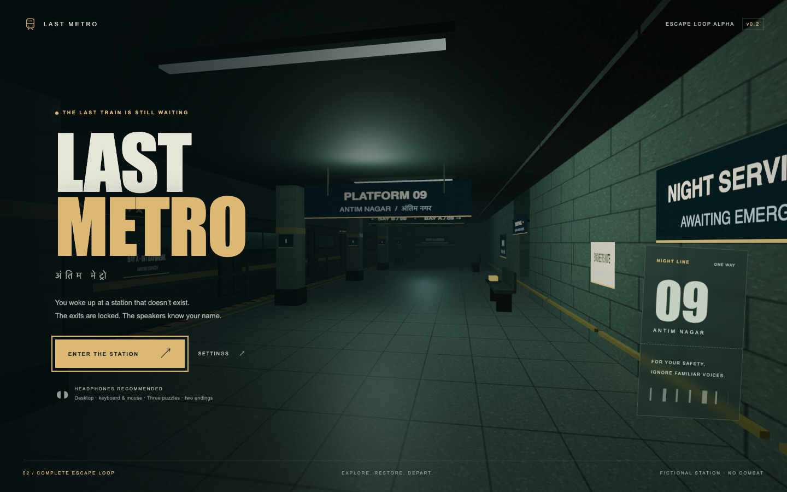

# Last Metro

A first-person atmospheric escape game set in a fictional Indian metro station. Built for desktop browsers with TypeScript, Three.js, Rapier, and Vite.

**Current milestone: v0.2.0 / complete escape-loop alpha.** Restore power, reconstruct staff access, verify conflicting departure evidence, and choose which train to board. Three puzzles and two endings are playable. This is not a production release. See [progress](docs/PROGRESS.md) for the verified state and [roadmap](docs/ROADMAP.md) for release gates.



## Development

Node 24.16.0 is pinned in `.nvmrc`.

```sh
npm ci
npm run dev
```

Open the local URL printed by Vite in a desktop browser. Audio and mouse capture begin after a player gesture. Chrome is the initial automated test target; Safari needs a manual validation pass before support is claimed.

For a preview of the built game:

```sh
npm run build
npm run preview -- --port 4173 --strictPort
```

Open [the local preview](http://127.0.0.1:4173). The server must be running. Checkpoints and settings are local to each browser and origin, so the dev server and built preview have separate saves.

## Controls

| Input | Action |
| --- | --- |
| W / A / S / D | Move |
| Mouse | Look; hold and drag if pointer capture is unavailable |
| Shift | Sprint |
| C | Toggle crouch |
| E | Inspect, collect, or operate |
| F | Toggle flashlight |
| Tab | Open journal; use Tab to navigate menu controls |
| Escape | Pause or close a menu |

Read the engineer’s note on the right platform wall first. Clues and recording transcripts stay in your journal. A spoiler walkthrough is in [QA](docs/QA.md) if you get stuck. Active enemy pursuit is the next phase.

The 18-minute departure window starts after 30 seconds of active orientation or your first collected item/note. Menus and focus loss pause time. Expiry preserves completed puzzles and clues and restores a safe checkpoint with a fresh window.

POC saves migrate automatically: fuses, notes and restored power are retained, while the new access and departure puzzles start unsolved. The legacy save is kept intact; the alpha writes a separate version 2 save. Saves belong to the browser and origin used to play.

## Validation

```sh
npm run check
npx playwright install chromium
npm run test:e2e
```

The first command checks types, state tests, formatting, and the build. Browser checks cover progression, collision, focus/pause, saves, settings, and a continuous navigation route. See [QA](docs/QA.md) for the measured environment and remaining release gates.

## Project map

```text
src/
  game/         Game orchestration, player, physics, state
  world/        Authored station geometry, materials, interactions
  audio/        Procedural ambience and interaction cues
  ui/           DOM interface, settings, accessibility
  styles/       Menu and HUD styles
tests/          State and browser regression checks
docs/           Roadmap, progress, architecture, QA, decisions
public/         Static assets packaged with the game
.github/        Continuous integration
```

The two original design documents remain at the root as the design baseline. Runtime code stays in `src`; release assets go in `public`; generated build output is ignored. Dependencies are pinned and the lockfile is committed. No runtime API keys or backend are required.

## Working agreement

Use small conventional commits (`docs:`, `chore:`, `feat:`, `fix:`, `test:`). Update `docs/PROGRESS.md` at each milestone with completed scope, validation, limitations, and next work. Keep production claims tied to the gates in the roadmap. Local commits are the initial recovery mechanism; a remote backup is still to be configured.
