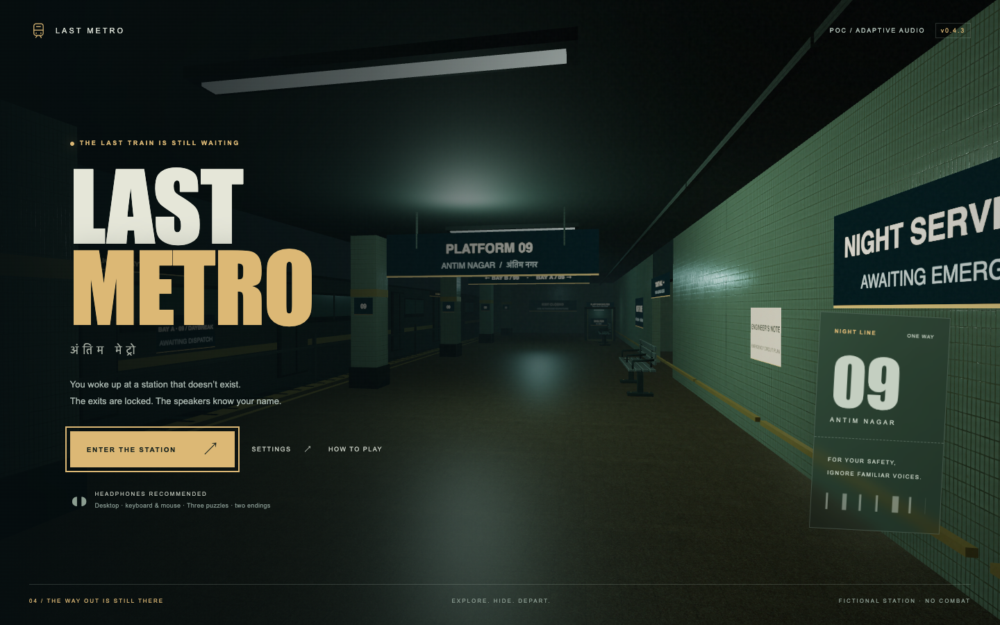

# Last Metro

**This project is a proof of concept (POC) for evaluating GPT-6's capabilities in game development.** It explores planning, implementation, debugging, testing, and iteration through a playable browser game.

A first-person atmospheric escape game set in a fictional Indian metro station. Built for desktop browsers with TypeScript, Three.js, Rapier, and Vite.

**Current POC build: v0.4.3 / adaptive horror audio milestone.** Restore power, reconstruct staff access, evade a listening shadow, and choose which train to board. Three puzzles, stealth and two endings are playable. This is not a production release. See [progress](docs/PROGRESS.md) for the verified state and [roadmap](docs/ROADMAP.md) for release gates.



## Development

Node 24.16.0 is pinned in `.nvmrc`.

```sh
npm ci
npm run dev
```

Open the local URL printed by Vite in a desktop browser. Audio and mouse capture begin after a player gesture. Chrome is the initial automated test target; Safari needs a manual validation pass before support is claimed.

For a preview of the built game:

```sh
npm run build
npm run preview -- --port 4173 --strictPort
```

Open [the local preview](http://127.0.0.1:4173/?v=0.4.3). The server must be running. Checkpoints and settings are local to each browser and origin, so the dev server and built preview have separate saves.

## Controls

| Input | Action |
| --- | --- |
| W / A / S / D | Move |
| Mouse | Look; hold and drag if pointer capture is unavailable |
| Shift | Sprint |
| C | Toggle crouch |
| E | Inspect, collect, operate, or enter/leave a shelter |
| Q | Throw a metal token toward open floor |
| F | Toggle flashlight |
| Tab | Open journal; use Tab to navigate menu controls |
| H | Open optional staged hints |
| Escape | Pause or close a menu |

Use **How to play** from the title or pause for movement, puzzles and stealth guidance. Press **H** for optional hints: direction first, locations next, then an explicitly requested solution. Hints pause the game and never consume items.

At the power cabinet, **select a fuse and click a holder**, or **drag it into place**. Tab and Enter/Space provide the same controls. Wrong holders spark and eject the cartridge back to the tray; nothing is consumed. Click a seated fuse to remove it. Fit both required fuses, throw the main breaker, then close the cabinet. The engineer’s note and optional hints show the connections.

Player footsteps now include shoe impacts and scuffs; sprinting is faster/louder, and crouching is quieter. The shadow has heavier directional footsteps that are muffled through walls. A low horror bed plays beneath exploration, with suspense strings and a quickening pulse that fade up near the enemy and ease away with distance or concealment.

Settings include large text, high contrast, optional automatic reminders, captions, independent master/effects/music/voice volumes and reduced motion/flicker. **Music & suspense** controls the horror soundtrack separately from footsteps. Spoken announcements lower the background mix while speaking. The low preset reduces scene resolution and decorative lighting while keeping notes and menus crisp.

Read the engineer’s note on the right platform wall first. Clues and recording transcripts stay in your journal. A spoiler walkthrough is in [QA](docs/QA.md) if you get stuck. Power wakes the shadow after a 12-second warning. Walking is quiet; crouching is quieter; sprinting attracts it. Walls block its sight. Break sight, step inside a marked shelter and press E to hide. It remembers seeing you enter. A token can redirect it after you break sight; there are three per attempt. The ventilation purge beside the service entrance runs for eight seconds and can be reused after a 24-second cooldown.

The 18-minute departure window starts after 30 seconds of active orientation or your first collected item/note. Menus and focus loss pause time. Expiry or capture preserves completed puzzles and clues and restores a safe checkpoint with a fresh window. Recovery also resets the shadow, grants 12 seconds of safety and replenishes three tokens. Hiding keeps time running; menus pause the enemy, station audio and clock. Short user-triggered cabinet clicks/crackles play separately and stop on close or focus loss.

The flashlight illuminates the station; it does not repel the enemy. The HUD gives contextual instructions when you are seen, concealed or in the recovery safety window.

Existing v2 saves remain compatible. Unpowered fuse placement survives closing/reopening the cabinet during a run; reloading an unpowered save returns the recovered fuses to the tray. Powered saves reopen with both fuses installed. POC saves migrate automatically: fuses, notes and restored power are retained, while the new access and departure puzzles start unsolved. The legacy save is kept intact; the game writes a separate version 2 save. Saves belong to the browser and origin used to play.

## Validation

```sh
npm run check
npx playwright install chromium
npm run test:e2e
```

The first command checks types, state tests, formatting, and the build. Browser checks cover progression, collision, focus/pause, saves, settings, and a continuous navigation route. See [QA](docs/QA.md) for the measured environment and remaining release gates. With the built preview running, `npm run test:preview` checks production assets, audio and checkpoint interaction.

## Project map

```text
src/
  game/         Game orchestration, player, collision navigation, enemy, state
  world/        Authored station geometry, materials, interactions
  audio/        Spatial sound, bundled voice registry and audio mixing
  ui/           DOM interface, settings, accessibility
  styles/       Menu and HUD styles
tests/          State, navigation, threat, audio and browser checks
scripts/        Optional asset/voice authoring and validation
assets/source/  Editable Blender props, provenance and verification manifests
docs/           Roadmap, progress, architecture, QA, decisions
public/         Static assets packaged with the game
.github/        Continuous integration
```

The two original design documents remain at the root as the design baseline. Runtime code stays in `src`; release assets go in `public`; generated build output is ignored. Dependencies are pinned and the lockfile is committed. No runtime API keys or backend are required.

## Assets and voice authoring

The POC now uses Poly Haven tile/terrazzo materials, three original Blender props and four Google Gemini/Charon PA recordings. All shipped assets are committed; builds and gameplay need no API key. Exact scripts and subtitles share `src/audio/voices.ts`.

See [asset provenance](docs/ASSETS.md), [Blender/material reproduction](docs/ASSET-UPGRADE.md) and [Google voice setup and local verification](docs/VOICE-AUTHORING.md). Editable `.blend` files and manifests live under `assets/source`. Human listening and playtesting remain part of the release gates.

## Working agreement

Use small conventional commits (`docs:`, `chore:`, `feat:`, `fix:`, `test:`). Update `docs/PROGRESS.md` at each milestone with completed scope, validation, limitations, and next work. Keep production claims tied to the gates in the roadmap. Local commits are the initial recovery mechanism; a remote backup is still to be configured.
